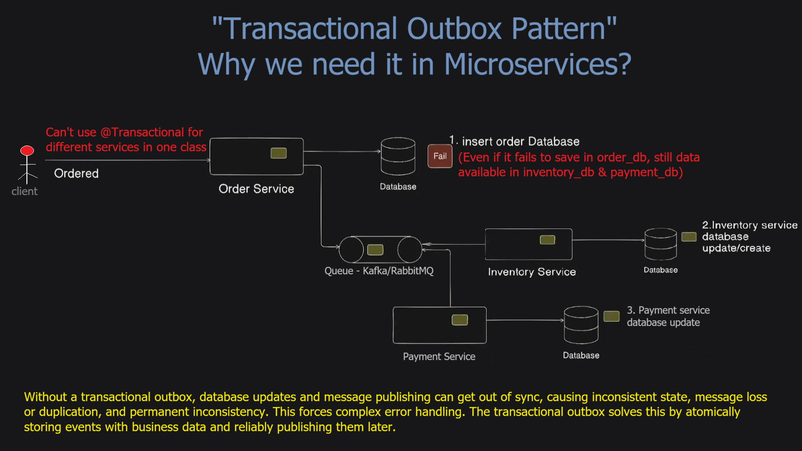
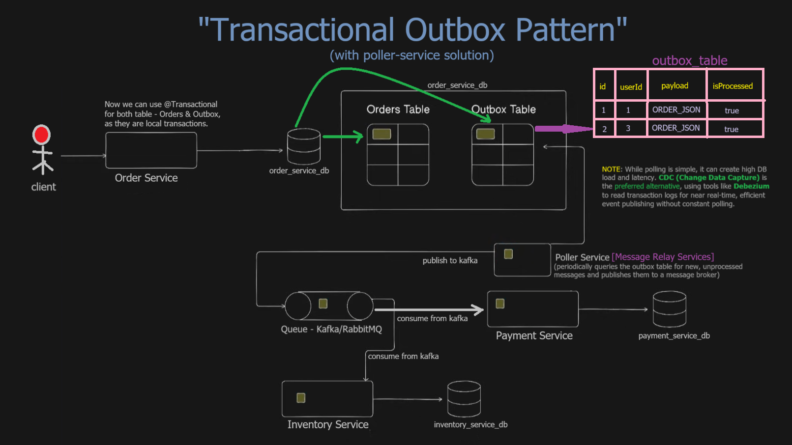

# Spring Boot Transactional Outbox Pattern

## Overview
This project demonstrates the **Transactional Outbox Pattern** with a **Poller Service** for reliable message publishing in distributed systems.

The project addresses the challenge of maintaining data consistency across distributed systems by ensuring that database updates and message publishing occur reliably. It utilizes a Poller Service to scan an outbox table and relay events to Kafka, which then triggers updates in an inventory service. The technical stack features Docker, MySQL, and Swagger UI to facilitate easy deployment and testing of the end-to-end workflow. By decoupling the initial transaction from message delivery, the system achieves eventual consistency and prevents data loss during service failures. Detailed documentation and architectural diagrams are included to help developers understand the integration of distributed messaging and persistent storage.

## Why Transactional Outbox Pattern

When client provides order, order_service_db will have two tables both will get updated: order_table & outbox_table. order-poller-service job is to take data from outbox_table of order_service_db based on isProcessed column is false (that is not processed i.e. 0), and push to Kafka based on latest scheduled poll. Then from Kafka, data will go to inventory_service_db where stock will be updated (subtract number of quantity of stocks purchased in order).


The transactional outbox pattern is needed because @Transactional works only within a single service and database. In microservices, database updates and message publishing can't be atomic. Without an outbox, failures cause inconsistent data across services like order, payment, and inventory, breaking reliability and eventual consistency.

## Solution - Transactional Outbox Pattern with Poller Service

A poller service in the transactional outbox pattern is a separate component that periodically (say, Schedule it with cron job, here in each fixed rate of 60 sec) scans the outbox table for unpublished events and sends them to the message broker. After successful delivery, it marks events as processed, ensuring reliable, retryable message publication and eventual consistency.

## Alternative Approaches

### CDC (Change Data Capture)
While polling is simple but can introduce high DB load and latency, you could use a CDC tool like **Debezium** to capture database changes and publish them to Kafka. This approach eliminates the need for an outbox table and poller service, but requires more complex infrastructure setup.


## 🚀 Quick Start

### Prerequisites
- Docker and Docker Compose installed
- Ports 3306, 3308, 8081, 9092, 9191, 9192, 9193 available

### Start All Services
```bash
# Start all services (infrastructure + microservices)
docker compose up -d

# Wait 60 seconds for all services to initialize
```

### Create Kafka Topic
```bash
docker exec kafka kafka-topics --bootstrap-server localhost:9092 --create --topic unprocessed-order-events --partitions 3 --replication-factor 1 --if-not-exists
```

### 🧪 Test the Complete Flow

#### 1. Check Services Status
```bash
docker ps
```

#### 2. Access Swagger UI for Testing
- **Order Service**: http://localhost:9191/swagger-ui/index.html
- **Order Poller**: http://localhost:9193/swagger-ui/index.html  
- **Inventory Service**: http://localhost:9192/swagger-ui/index.html
- **Kafka UI**: http://localhost:8081

#### 3. Check Initial Inventory
```bash
curl http://localhost:9192/api/inventory
```
Expected: Laptop quantity = 50

#### 4. Create Order via Swagger UI
1. Open http://localhost:9191/swagger-ui/index.html
2. Expand "Order Management" 
3. Use POST /api/orders
```json
{
  "name": "Laptop",
  "customerId": "customer123", 
  "productType": "Electronics",
  "quantity": 2,
  "price": 999.99
}
```

#### 5. Monitor the Flow
- **Kafka UI**: Watch `unprocessed-order-events` topic
- **Order Poller Logs**: `docker logs order-poller`
- **Inventory Service Logs**: `docker logs inventory-service`

#### 6. Verify Inventory Update (after ~60 seconds)
```bash
curl http://localhost:9192/api/inventory
```
Expected: Laptop quantity = 48 (reduced by 2)

## 🔍 Debugging Commands

### Check Outbox Messages
```bash
curl http://localhost:9193/api/poller/outbox
```

### Trigger Manual Poll
```bash
curl -X POST http://localhost:9193/api/poller/trigger
```

### Check Service Logs
```bash
docker logs order-service
docker logs order-poller  
docker logs inventory-service
```

## 📊 Architecture Flow
```
Client → Order Service → Order DB + Outbox → Order Poller → Kafka → Inventory Service → Inventory DB
```

## Architecture
```
┌─────────────┐    ┌──────────────┐    ┌─────────────┐     ┌─────────────────┐      
│ OrderService│──▶│   Kafka      │───▶│Order Poller │───▶│InventoryService │
│ (Port 9191) │    │ (KRaft Mode) │    │ (Port 9193) │     │ (Port 9192)     │
└─────────────┘    │ (Port 9092)  │    └─────────────┘     └─────────────────┘
        │          └──────────────┘           │                    │
        ▼                 │                   ▼                    ▼
┌─────────────┐    ┌──────▼───────┐    ┌─────────────┐      ┌──────────────────┐
│MySQL:3306   │    │   Kafka UI   │    │MySQL:3307   │      │ MySQL:3308       │
│order_service│    │ (Port 8081)  │    │order_poller │      │inventory_service │
└─────────────┘    └──────────────┘    └─────────────┘      └──────────────────┘
```

## Expected Behavior
1. Order created in order_service_db.ORDER_TBL
2. Outbox entry created in order_service_db.OUTBOX_TBL  
3. Order Poller picks up unprocessed messages every 60 seconds
4. Message published to Kafka topic `unprocessed-order-events`
5. Inventory Service consumes message and updates stock
6. Stock quantity reduces accordingly

## 🔧 Fixed Issues
-  **Stock Quantity Reduction**: Fixed DTO mapping between services
-  **OpenAPI/Swagger**: Added comprehensive API documentation
-  **Docker Optimization**: Reduced from 4 files to 2 files (Dockerfile + docker-compose.yml)
-  **Health Checks**: Added actuator endpoints and health checks
-  **Service Dependencies**: Added proper service dependencies and conditions

## 🛑 Stop Services
```bash
docker compose down
```

## 📋 Services Available
```
.....................................................................................
| Service                   | Port | Description                                    |
|---------------------------|------|------------------------------------------------|
| Kafka (KRaft)             | 9092 | Message broker without Zookeeper               |
| Kafka UI                  | 8081 | Web UI for Kafka management                    |
| MySQL (order-service)     | 3306 | Database for order service                     |
| MySQL (inventory-service) | 3308 | Database for inventory service                 |
| Order Service             | 9191 | REST API for creating orders                   |
| Order Poller              | 9193 | Polls outbox and publishes to Kafka            |
| Inventory Service         | 9192 | Consumes events and updates inventory          |
.....................................................................................
```

## Initial Data Setup

**Inventory Data:** The system comes pre-loaded with sample inventory data:
- Laptop: 50 units at $999.99
- Mouse: 200 units at $29.99  
- Keyboard: 150 units at $79.99
- Monitor: 75 units at $299.99
- Webcam: 100 units at $89.99

This data is automatically inserted when MySQL containers start.

## 🏗️ Optimized Docker Setup

The project now uses only **2 Docker files**:
- `Dockerfile`: Multi-stage build for all services with layer caching optimization
- `docker-compose.yml`: Complete infrastructure and application setup with health checks

**Features:**
- Layer caching for faster builds
- Health checks for service dependencies
- Optimized JVM settings for containers
- Proper service orchestration with restart policies